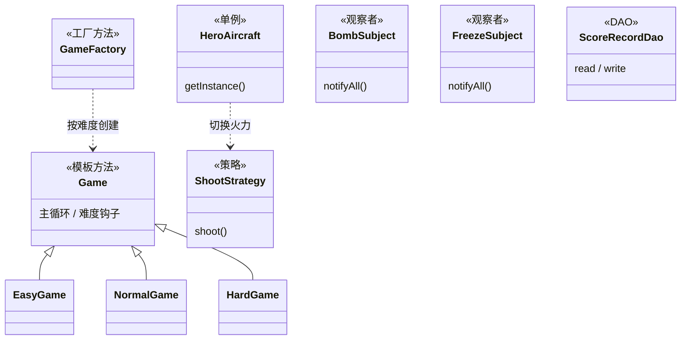

<h1 align="center">AircraftWar</h1>

<p align="center">
  
  
  
  
  
</p>

AircraftWar 是一个基于 Java Swing 的“飞机大战”课程实验项目。项目在可运行的桌面游戏基础上，集中练习了单例、工厂方法、策略、模板方法、观察者和 DAO 等面向对象设计模式。

## 功能概览

- 三档难度：`easy`、`normal`、`hard`，不同难度拥有独立的敌机生成节奏、血量/速度成长、Boss 与补给策略。
- 完整战斗循环：英雄机移动、自动射击、敌机生成、子弹碰撞、道具掉落、分数结算和游戏结束判定。
- 多种敌机与道具：普通敌机、精英敌机、强化精英机、Boss，以及回血、火力、炸弹、冻结等补给。
- 排行榜：按难度读写 `scores/records-*.txt`，支持保存、排序和按名次删除记录。
- 成就系统：记录高分、击败 Boss、炸弹清屏、冻结控制、击毁高级敌机等成就。
- Swing 页面流转：难度选择页、游戏页和排行榜页通过 `CardLayout` 切换。
- 音效管理：统一管理背景音乐、射击、爆炸、命中和道具音效。

## 快速开始

### 环境要求

- JDK 8 或更高版本
- Windows、macOS 或 Linux 桌面环境
- 可选：VS Code + Java Extension Pack

项目使用本地 `lib/junit5/` 下的 JUnit 5 jar 运行测试，不需要额外下载 Maven 或 Gradle 依赖。

### 在 VS Code 中运行

1. 安装推荐扩展：`vscjava.vscode-java-pack` 和 `vscjava.vscode-java-test`。
2. 打开项目根目录。
3. 运行主类 `edu.hitsz.application.Main`。

启动后默认进入难度选择页。也可以给主类传入难度参数直接开始游戏：

```bash
easy
normal
hard
```

### 使用命令行运行

在项目根目录执行：

```powershell
javac -encoding UTF-8 -d out (Get-ChildItem -Recurse src -Filter *.java | ForEach-Object FullName)
java -cp out edu.hitsz.application.Main
```

直接启动指定难度：

```powershell
java -cp out edu.hitsz.application.Main hard
```

开发目录运行时，图片和音频资源会从 `src/images/` 与 `src/videos/` 读取；打包为 JAR 后会优先从 JAR 内的 `images/` 与 `videos/` 资源目录读取。

### 运行发布包

下载发布包并解压后，在解压目录执行：

```powershell
java -jar AircraftWar-0.1.1.jar
```

如果需要直接进入指定难度，可追加难度参数：

```powershell
java -jar AircraftWar-0.1.1.jar hard
```

Windows 用户也可以下载 `AircraftWar-0.1.1-windows-x64.zip`，解压后双击 `AircraftWar\AircraftWar.exe`。该包内置运行时，首次下载解压后，后续不需要再安装 JDK 或重复配置命令。

### 生成发布包

项目不依赖 Maven 或 Gradle。发布包可用 JDK 自带工具生成，资源目录需放在 classpath 根目录下的 `images/` 和 `videos/`：

```powershell
Remove-Item -Recurse -Force build\classes,build\release -ErrorAction SilentlyContinue
New-Item -ItemType Directory -Force build\classes,build\release | Out-Null
javac -encoding UTF-8 -d build\classes (Get-ChildItem -Recurse src -Filter *.java | ForEach-Object FullName)
Copy-Item -Recurse src\images build\classes\images
Copy-Item -Recurse src\videos build\classes\videos
jar --create --file build\release\AircraftWar-0.1.0.jar --main-class edu.hitsz.application.Main -C build\classes .
```

生成 Windows 可执行程序包需要 JDK 自带 `jpackage`：

```powershell
jpackage --type app-image --name AircraftWar --app-version 0.1.1 --input build\release\package-input --main-jar AircraftWar-0.1.1.jar --dest build\release\windows-x64
Compress-Archive -Path build\release\windows-x64\AircraftWar -DestinationPath build\release\AircraftWar-0.1.1-windows-x64.zip -Force
```

## 测试

测试代码位于 `test/`，覆盖飞行器、道具、工厂、策略、排行榜、难度模板和部分游戏逻辑。

在 VS Code 中可以使用 Java Test Runner 运行所有测试。命令行可使用 JUnit Platform Console：

```powershell
javac -encoding UTF-8 -cp "lib/junit5/*;src" -d build/test-classes (Get-ChildItem -Recurse src,test -Filter *.java | ForEach-Object FullName)
java -jar lib/junit5/junit-platform-console-standalone-1.7.0.jar --class-path build/test-classes --scan-class-path
```

## 项目结构

```text
src/edu/hitsz/
├── aircraft/      # 英雄机、普通敌机、精英敌机、Boss 等飞行器
├── application/   # Swing 界面、游戏主循环、难度、音效、成就和入口类
├── basic/         # 飞行对象基础抽象
├── bullet/        # 英雄机子弹和敌机子弹
├── dao/           # 排行榜记录与文本文件持久化
├── factory/       # 敌机与道具工厂
├── prop/          # 补给道具、炸弹/冻结观察者主题
└── strategy/      # 不同射击策略

test/              # JUnit 5 测试
scores/            # 各难度排行榜文本文件
uml/               # 设计模式类图 PlantUML 文件
lib/junit5/        # JUnit 5 本地依赖
```

## 设计模式

| 模式                | 代表类                                       | 用途                                           |
|---------------------|----------------------------------------------|------------------------------------------------|
| 单例模式            | `HeroAircraft`                               | 保证英雄机在游戏中全局唯一                     |
| 简单工厂 / 工厂方法 | `GameFactory`、`EnemyFactory`、`PropFactory` | 根据难度或概率创建游戏、敌机和道具             |
| 策略模式            | `ShootStrategy` 及实现类                     | 动态切换直射、散射、环射等火力方式             |
| 模板方法            | `Game`、`EasyGame`、`NormalGame`、`HardGame` | 在统一游戏主循环中开放不同难度的参数与成长规则 |
| 观察者模式          | `BombSubject`、`FreezeSubject`               | 炸弹和冻结道具统一通知屏幕内目标               |
| DAO                 | `ScoreRecordDao`、`FileScoreRecordDao`       | 隔离排行榜数据读写逻辑                         |

对应类图保存在 `uml/` 目录中。



## 排行榜数据

排行榜使用普通文本文件保存：

```text
scores/records-easy.txt
scores/records-normal.txt
scores/records-hard.txt
```

首次运行时如果文件不存在，DAO 会自动创建对应难度的记录文件。

## 开发提示

- Swing 组件在 EDT 上创建，计时器线程触发的页面切换会回到 EDT 执行。
- 资源路径依赖项目根目录，移动运行目录后可能无法加载 `src/images/` 或 `src/videos/` 下的文件。
- `build/`、`out/`、IDE 配置、实验文档目录和 Word 文件已通过 `.gitignore` 排除，不会进入版本库。